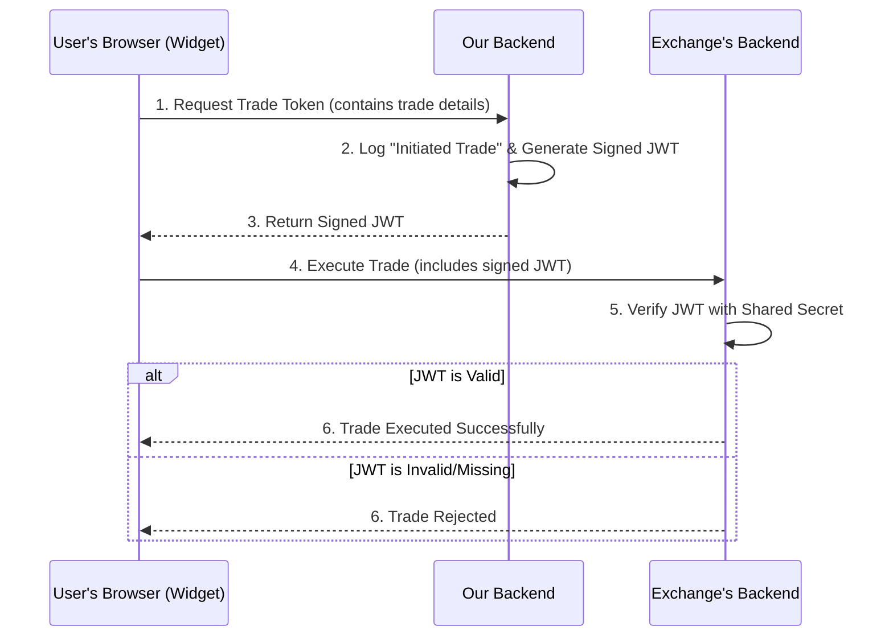

# Secure Trading Widget Integration

## 1. Problem Statement

We need to provide a trading widget to a third-party exchange. This widget will be embedded in their website. Our business model requires us to charge a small fee for every trade executed through this widget.

The core challenge is ensuring that we can reliably track every trade initiated from our widget, even though the code runs entirely within an environment controlled by the exchange. The exchange has a business incentive to under-report trades to avoid fees, so we cannot trust them to execute the tracking logic faithfully.

The key constraints are:
- The widget must initiate trades directly against the exchange's API from the user's browser (we do not want to proxy the trade through our backend).
- We must prevent the exchange from modifying the widget's JavaScript code to disable our trade tracking mechanism.
- The solution must be secure, reliable, and have minimal impact on trading latency.

## 2. Insecure Approach (and why it's flawed)

A naive approach would be to have the widget perform two actions in parallel when the user clicks "trade":
1.  Send the trade to the exchange's API.
2.  Send a "trade executed" message to our backend via a WebSocket connection for tracking.

This is fundamentally insecure. The exchange can easily inspect the widget's minified/obfuscated JavaScript, identify the WebSocket call, and simply remove it. They could then deploy this modified version of the widget, and we would have no way of knowing that trades were being executed without being tracked. **Any solution that relies on trusting client-side code is not a solution.**

## 3. Proposed Secure Solution: One-Time Trade Token

The only robust solution is to make our backend a mandatory, non-bypassable step in the trade execution flow, without proxying the trade itself. We can achieve this using a cryptographically secure, single-use token system.

This approach requires minimal cooperation from the exchange (a single check on their backend) but provides maximum security for us.

### High-Level Workflow



### Addressing Latency Concerns

Your concern about latency is entirely valid. Fast execution is critical in trading, which is why the trade is **still sent directly from the user's browser to the exchange's API.**

Our backend does **not** act as a proxy for the trade. It is not in the critical path of the actual trade execution data flow. Instead, it serves as a very fast, preliminary authorization step.

The added latency is limited to a single, highly optimized HTTPS roundtrip:
1.  **Widget to Our Backend:** A small request containing the trade parameters.
2.  **Our Backend Processing:** An extremely fast, in-memory cryptographic operation (signing a JWT). This does not require slow database lookups before responding.
3.  **Our Backend to Widget:** A small response containing the signed token.

We can expect this entire process to add only **50-150ms** of latency, depending on the user's network connection. This is a negligible and acceptable trade-off to gain the security and verifiability required for our business model. The heavy-lifting of the actual trade is still handled directly by the exchange's infrastructure.

### Step-by-Step Breakdown

1.  **User Clicks Trade:** The user clicks a trade button in our widget on the exchange's website.
2.  **Widget Calls Our Backend:** Instead of calling the exchange directly, the widget first sends the trade details (e.g., pair, amount, side) to a new, authenticated API endpoint on *our* backend (e.g., `/api/widget/generate-trade-token`).
3.  **Our Backend Verifies & Logs:** Our server receives the request. It immediately logs this as an "initiated trade," which is the event we will use for billing and tracking.
4.  **Our Backend Generates a Signed Token:** Our server generates a unique, short-lived (e.g., valid for 5-10 seconds), single-use [JSON Web Token (JWT)](https://jwt.io/). This token contains the exact trade details (pair, amount, etc.) and is cryptographically signed with a secret key known *only* to our server and the exchange's server.
5.  **Our Backend Returns the Token:** Our server sends this signed token back to the widget.
6.  **Widget Calls the Exchange:** The widget immediately takes this token and calls the exchange's standard trading endpoint. It must include the token in the request (e.g., in an `Authorization: Bearer <token>` header or a request body parameter).
7.  **Exchange Backend Verifies Token:** The exchange's backend receives the trade request. Before executing the trade, it performs these critical checks:
    *   Is a token present?
    *   Is the token's signature valid (checked using the shared secret)?
    *   Has the token expired?
    *   Do the trade details in the token match the trade details in the request?
    *   (Optional but recommended) Has this token been used before (nonce check)?
    If all checks pass, the exchange executes the trade. If any check fails, the trade is rejected with an error.

### Why This Works

*   **Trust is Removed from the Client:** The exchange *cannot* execute a trade without first obtaining a valid, signed token from our server.
*   **No Code Tampering:** They have no incentive to modify the widget's code, because their own server will reject any trade that doesn't present a valid token obtained from us.
*   **Accurate Tracking:** We have a verifiable, server-side record of every single trade that was authorized.
*   **Minimal Latency:** The additional step is a single, fast, round-trip to our backend to generate a token. The core trade execution remains a direct call from the user's browser to the exchange's API. We are not a slow proxy.
*   **High Security:** The use of a shared secret and signed JWTs ensures that tokens cannot be forged by the exchange or a malicious user.

## 4. Implementation Plan

### Our Backend Responsibilities
-   Create a new route: `POST /api/app/widget/generate-trade-token`.
-   Create a new `widget.service.js` to handle the business logic of generating and signing JWTs. The JWT payload should include trade specifics and an expiration time (`exp`).
-   Create a new `widget.controller.js` to manage the request/response flow.
-   Establish and securely store a unique, strong shared secret for signing tokens for this specific exchange.

### Exchange Backend Responsibilities
-   Securely store the same shared secret provided by us.
-   Modify their trading endpoint to require the JWT for trades identified as coming from our widget.
-   Implement the logic to validate the JWT's signature, expiration, and payload against the incoming trade request.
-   Reject any trade that fails validation.

## 5. Deployment and User Identification

### Widget Deployment

We will **not** provide the exchange with the widget's source code. Instead, they will integrate the widget into their website by adding a simple `<script>` tag to their HTML. This script will load the widget directly from our secure servers or a Content Delivery Network (CDN).

**Example HTML:**
```html
<!-- The exchange adds this tag to their trading page -->
<div id="our-widget-container"></div>
<script src="https://cdn.our-domain.com/widget/v1/main.js" defer></script>
```

This approach has two major advantages:
1.  **Centralized Control:** We retain full control over the widget's code. We can deploy updates, bug fixes, and new features instantly and universally without requiring any action from the exchange.
2.  **Prevents Tampering:** The exchange cannot easily modify the code because they are not hosting it. They only ever receive the production-ready JavaScript bundle, just like any other user.

### Identifying Users

To track which user is executing a trade, the exchange's frontend must securely pass a unique identifier for their logged-in user to our widget upon initialization. This identifier should be **stable** (it doesn't change for the user) but also **anonymized** (it should not be the user's email or personal information).

The exchange will invoke an initialization function exposed by our widget's script, passing this user ID in a configuration object.

**Example JavaScript:**
```javascript
// The exchange's frontend code calls this after our script has loaded
// and they have identified their user.
OurWidget.init({
  container: '#our-widget-container',
  exchangeUserId: 'f47ac10b-58cc-4372-a567-0e02b2c3d479' // A stable, unique, anonymized ID
});
```

Our widget will then include this `exchangeUserId` in the payload of the request it sends to our backend for a trade token. Our backend will, in turn, embed this ID within the signed JWT and log it alongside the trade details. This provides a complete, end-to-end audit trail for every trade, linked to a specific user, without compromising user privacy.

## 6. Scaling to Support Multiple Exchanges

To evolve this from a single-partner solution into a scalable, multi-tenant platform, we need to introduce concepts for exchange identification, isolated security, and dynamic configuration.

### A. Unique Exchange Identifier (`exchangeId`)

First, each exchange partner will be issued a unique, public `exchangeId`. This is a non-secret key that tells our system which exchange is loading the widget. The exchange will include this ID in the widget initialization.

**Updated Example JavaScript:**
```javascript
// The exchange's frontend code now includes their unique exchangeId
OurWidget.init({
  container: '#our-widget-container',
  exchangeId: 'blofin-exchange-prod', // Public identifier for the exchange
  exchangeUserId: 'f47ac10b-58cc-4372-a567-0e02b2c3d479'
});
```
The widget will pass this `exchangeId` in every subsequent API call to our backend.

### B. Per-Exchange Security

This is the most critical architectural change for security. We will **not** use a single shared secret. Instead, **each exchange partner will have their own unique, cryptographically strong secret signing key.**

On our backend, we will maintain a secure mapping of each `exchangeId` to its corresponding secret key. When a request for a trade token comes in from `exchangeId: 'blofin-exchange-prod'`, our backend will:
1.  Look up the secret key specifically associated with 'blofin-exchange-prod'.
2.  Use that unique secret to sign the JWT.

This ensures that the security of our partners is completely isolated. A compromise of one exchange's secret key has no impact on any other partner.

### C. Dynamic Theming and Configuration

To allow for customization, we will introduce a new configuration endpoint on our backend, for example: `GET /api/widget/config`.

When the widget loads, it will take the `exchangeId` from its `init()` call and make a request to this endpoint.

**Widget Loading Flow:**
1.  Widget script is loaded from our CDN.
2.  Exchange calls `OurWidget.init({ exchangeId: 'blofin-exchange-prod', ... })`.
3.  Widget makes a background request: `GET /api/widget/config?id=blofin-exchange-prod`.
4.  Our backend looks up the configuration for 'blofin-exchange-prod' and returns a JSON response.

**Example Configuration JSON Response:**
```json
{
  "theme": {
    "primaryColor": "#3A86FF",
    "backgroundColor": "#121212",
    "textColor": "#FFFFFF",
    "fontFamily": "'Roboto', sans-serif"
  },
  "features": {
    "showPnl": true,
    "allowMarketOrders": true
  }
}
```
The widget will then dynamically apply these settings, for instance, by injecting a `<style>` tag with CSS variables into the document, allowing each exchange to have a visually distinct, on-brand appearance without requiring us to maintain separate codebases.

### D. Role of the WebSocket Connection

The widget will absolutely **still maintain its WebSocket connection** to our backend. However, the roles of the two communication channels (HTTP and WebSocket) are distinct:

*   **WebSocket:** Used for **real-time, server-to-client data feeds.** This includes pushing news alerts, market data updates, and other live information to the widget. This is a long-lived connection for broadcast-style data.

*   **HTTPS Endpoint:** Used for **secure, client-initiated transactions.** Specifically, this is for the widget to request a one-time trade token from our server. This is a standard, stateless request/response action.

This architecture explicitly replaces the initial, insecure idea of sending a "trade executed" message from the widget to us over the WebSocket. That tracking is now handled securely on the server-side when a token is requested, which is a non-bypassable step.

## 7. Hosting, Scalability, and The Role of the CDN

A common question is how user volume affects the different parts of our system. It's critical to distinguish between *loading* the widget and *using* the widget.

### Phase 1: The Loading Phase (CDN's Responsibility)

When a user visits the exchange's website, their browser sees the `<script>` tag and downloads our `widget.js` file. This is where the CDN comes in.

1.  The browser requests the `widget.js` file from the CDN.
2.  The CDN serves this file from a server geographically close to the user, ensuring a fast download.
3.  Once downloaded, the code is loaded into the browser's memory.

The CDN's job is to handle the initial download volume. If 1,000 users load the page at once, the CDN will handle 1,000 simultaneous downloads. For a global CDN, this is a trivial amount of traffic.

### Phase 2: The Execution Phase (Browser's Responsibility)

Once the `widget.js` file is loaded, it runs entirely within the user's browser. It uses the user's computer's CPU and memory. **At this point, the CDN is no longer involved.**

When a user clicks a button in the widget:
1.  The JavaScript code **already in their browser** handles the click event.
2.  This local code then makes a network request **directly to our backend API server** to request a trade token.
3.  It **does not** contact the CDN again.

### Summary: Where the Load Goes

| Component            | What It Does                                                                       | Is it affected by button clicks? |
| -------------------- | ---------------------------------------------------------------------------------- | -------------------------------- |
| **CDN (Cloudflare)**   | Serves the static `widget.js` file to each user **once** upon page load.           | **No**                           |
| **User's Browser**     | **Executes** the downloaded `widget.js` code locally. Handles all UI interactions. | **Yes** (This is where the click is handled) |
| **Our Backend Server** | Maintains WebSocket connections and responds to API calls for trade tokens.        | **Yes** (A click results in an API call to our backend) |

This architecture is highly scalable. The CDN effortlessly handles the one-time load of the application code, while our backend is built to handle the continuous load of user interactions (API calls and WebSocket connections).

## 8. Recommended Project Structure: Separate Repositories

Given the distinct nature of the widget (a frontend application) and the existing backend, it is strongly recommended to develop the widget in its own dedicated project and source code repository.

This approach aligns with modern software architecture best practices for the following reasons:

1.  **Independent Deployment & Lifecycle:** The widget is a set of static assets (JavaScript, CSS) deployed to a CDN, while the backend is a service with its own deployment lifecycle. Separating them allows for independent, parallel CI/CD pipelines, preventing a change in one from creating a bottleneck for the other.

2.  **Separation of Concerns:** The widget is a frontend application, likely built with a modern JavaScript framework (e.g., React, Vue). Its technology stack, dependencies (`package.json`), and build tooling are completely different from the Node.js backend. A separate repository prevents complexity and conflicts in dependency management.

3.  **Clear Versioning:** The widget will have its own release cycle (`v1.0`, `v1.1`, etc.). A dedicated repository allows for clear Git tagging and version management that is specific to the widget, which is crucial when supporting multiple exchanges that may be on different versions.

4.  **Team Autonomy:** A separate repository allows a frontend-focused team to work on the widget autonomously without needing to navigate the backend codebase, reducing cognitive load and preventing merge conflicts.

5.  **Defined Security Boundary:** The API contract (requesting trade tokens, fetching config) serves as a clear and secure boundary. The widget repository only needs to contain frontend code, limiting the scope of access for developers and reducing the surface area for potential vulnerabilities.
